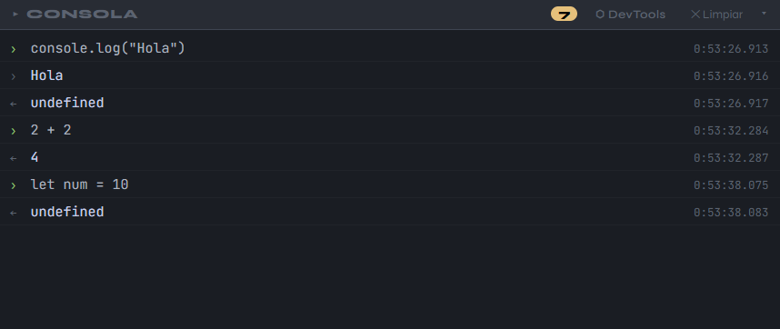
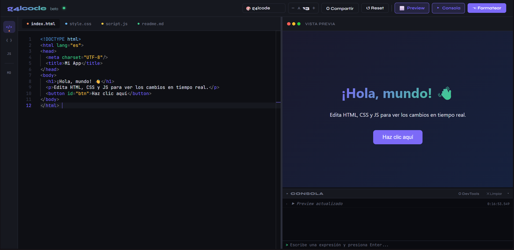

<div align="center">
 
# g4lcode
 


 
**Editor de código en vivo para el navegador, sin instalación, sin servidor.**  
Abre el archivo y escribe. Así de simple.
 
[🚀 Abrir editor](#instalación) · [✨ Ver características](#características) · [⌨️ Atajos](#atajos-de-teclado) · [🖥️ Consola REPL](#consola-repl)
 
</div>
 
---
 
## ¿Qué es g4lcode?
 
g4lcode es un editor de código web que corre completamente en el navegador. Está construido sobre **Monaco Editor** — el mismo motor que usa VS Code — y permite escribir HTML, CSS y JavaScript con vista previa en tiempo real, sin instalar nada ni levantar ningún servidor.
 
---
 
## Instalación
 
No hay instalación. Descarga el archivo y ábrelo.
 
```bash
# Clonar el repositorio
git clone https://github.com/tu-usuario/g4lcode.git
 
# Abrir en el navegador
open index.html
# o simplemente arrastra el archivo al navegador
```
 
> **Nota:** Funciona mejor en navegadores basados en Chromium (Chrome, Edge, Brave). Firefox tiene soporte parcial para los workers de Monaco.
 
---
 
## Características
 
### Editor
- **Monaco Editor** con resaltado de sintaxis completo para HTML, CSS, JavaScript y Markdown
- **Dos temas** incluidos: `g4lcode` (tema oscuro custom) y `One Dark Pro`
- **Emmet completo** — expande abreviaturas con Tab sin configuración extra
- **Autocompletado** con dropdown de sugerencias al escribir, estilo VS Code
- Control de **tamaño de fuente** desde la barra superior
- **Formateo de código** con `Ctrl+S`
- Resaltado de sintaxis mejorado con **Shiki** (carga asíncrona)
 
### Vista previa
- **Preview en tiempo real** — se actualiza 300ms después de dejar de escribir
- Soporte para **Markdown** con renderizado estilo GitHub
- Panel redimensionable arrastrando el divisor central
- **Scrollbar temática** que cambia con el tema del editor
 
### Consola REPL
- **REPL integrada** — escribe expresiones directamente y ve el resultado al instante
- Evalúa en el **contexto real del iframe**, con acceso a todas tus variables y funciones
- Intercepta `console.log`, `info`, `warn` y `error` automáticamente
- Muestra errores de JS y promesas rechazadas sin configuración
- **Historial de comandos** navegable con ↑ / ↓
- Badge con contador de mensajes y errores
- Panel redimensionable verticalmente, colapsa con clic en la barra de título
 
### Layout
- **Panel derecho flexible**: preview y consola conviven y son independientes
- Si ocultas el preview, la consola ocupa todo el panel derecho automáticamente
- Si ocultas ambos, el panel desaparece liberando espacio al editor
- Compartir código vía URL con `⬡ Compartir` — codifica todo el estado en el hash
 
---
 
## Consola REPL
 
La consola funciona como la de Chrome DevTools: puedes escribir cualquier expresión JavaScript y ver el resultado inmediatamente, con acceso completo al contexto de tu código.




### Lo que puedes hacer en la REPL

| Expresión               | Resultado                     |
| ----------------------- | ----------------------------- |
| `2 + 2`                 | `← 4`                         |
| `let x = 10`            | `← undefined`                 |
| `x * 3`                 | `← 30` (accede a la variable) |
| `'hola'.toUpperCase()`  | `← HOLA`                      |
| `[1,2,3].map(n => n*2)` | `← [2,4,6]`                   |
| `document.title`        | título del iframe             |
| `typeof null`           | `← object`                    |
| `Math.random()`         | número aleatorio              |
| `JSON.stringify({a:1})` | `← {"a":1}`                   |

> **Tip:** usa ↑ y ↓ para navegar el historial de comandos anteriores.

---

## Emmet

g4lcode incluye soporte completo de Emmet sin plugins externos. Escribe la abreviatura y presiona **Tab**. El dropdown de sugerencias también aparece mientras escribes.

### HTML

| Abreviatura           | Resultado                           |
| --------------------- | ----------------------------------- |
| `!`                   | Estructura HTML5 completa           |
| `div`                 | `<div></div>`                       |
| `div.clase`           | `<div class="clase"></div>`         |
| `div#id.clase`        | `<div id="id" class="clase"></div>` |
| `ul>li*3`             | Lista con 3 `<li>`                  |
| `a[href="#"]{texto}`  | `<a href="#">texto</a>`             |
| `h1+p`                | Un `h1` seguido de un `p`           |
| `div>p>span`          | Elementos anidados                  |
| `input[type="email"]` | `<input type="email">`              |

### CSS

| Abreviatura | Resultado             |
| ----------- | --------------------- |
| `df`        | `display: flex;`      |
| `dg`        | `display: grid;`      |
| `posa`      | `position: absolute;` |
| `mt16`      | `margin-top: 16px;`   |
| `w100%`     | `width: 100%;`        |
| `bgc`       | `background-color: ;` |
| `br8`       | `border-radius: 8px;` |
| `jc`        | `justify-content: ;`  |
| `ai`        | `align-items: ;`      |
| `tr`        | `transition: ;`       |

---

## Atajos de teclado

| Atajo             | Acción                           |
| ----------------- | -------------------------------- |
| `Tab`             | Expandir abreviatura Emmet       |
| `Ctrl+S`          | Formatear código                 |
| `Ctrl+Z`          | Deshacer                         |
| `Ctrl+Shift+Z`    | Rehacer                          |
| `Ctrl+/`          | Comentar/descomentar línea       |
| `Alt+↑ / Alt+↓`   | Mover línea arriba/abajo         |
| `Ctrl+D`          | Seleccionar siguiente ocurrencia |
| `Ctrl+Shift+K`    | Eliminar línea                   |
| `↑ / ↓` (en REPL) | Navegar historial de comandos    |
| `Enter` (en REPL) | Evaluar expresión                |

---

## Interfaz



---

## Tecnologías

| Tecnología                                                       | Uso                                         |
| ---------------------------------------------------------------- | ------------------------------------------- |
| [Monaco Editor 0.44](https://microsoft.github.io/monaco-editor/) | Motor del editor                            |
| [Shiki 1.29](https://shiki.style/)                               | Resaltado de sintaxis mejorado              |
| [Marked 9](https://marked.js.org/)                               | Renderizado de Markdown                     |
| Emmet (implementación propia)                                    | Expansión de abreviaturas                   |
| Web Workers                                                      | Language services de Monaco (HTML, CSS, JS) |
| `postMessage` API                                                | Comunicación entre editor y REPL del iframe |

Sin frameworks. Sin bundlers. Sin `node_modules`. Un solo archivo HTML.

---

## Estructura del proyecto

```
g4lcode/
├── index.html      # Todo el editor en un solo archivo
├── logo.png        # Ícono de la pestaña (opcional)
└── README.md       # Este archivo
```

---

## Compartir código

El botón **⬡ Compartir** codifica el estado completo del editor (HTML + CSS + JS + Markdown) en el hash de la URL usando Base64. Cualquier persona con el enlace verá exactamente el mismo código.

```
index.html#eyJodG1sIjoiPGgxPkhvbGE8L2gxPiIsImNzcyI6Imgxe2NvbG9yOnJlZH0ifQ==
```

---

## ⚠️ Sobre este proyecto

Este proyecto fue inicialmente generado con ayuda de IA como solución rápida a una necesidad personal (un editor tipo CodePen en local/web).

---

<div align="center">
 
Hecho con ☕ y Monaco Editor
 


[](https://github.com/g4lvan)
[](https://www.instagram.com/g4lvan_)
 
</div>
# g4lcode
